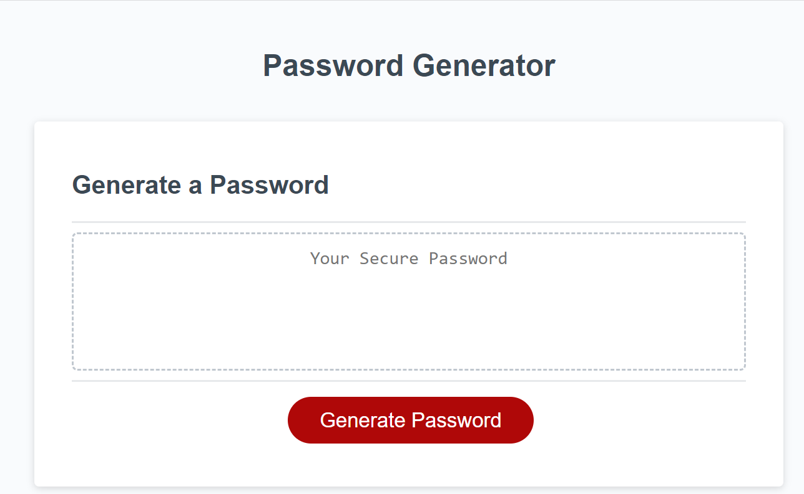
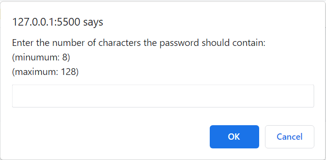
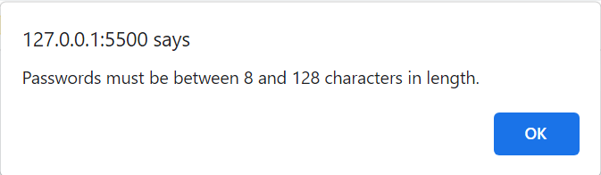
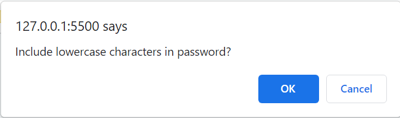
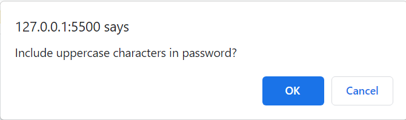
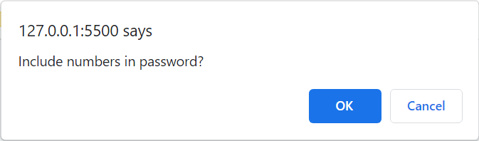
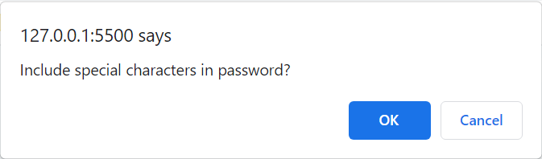
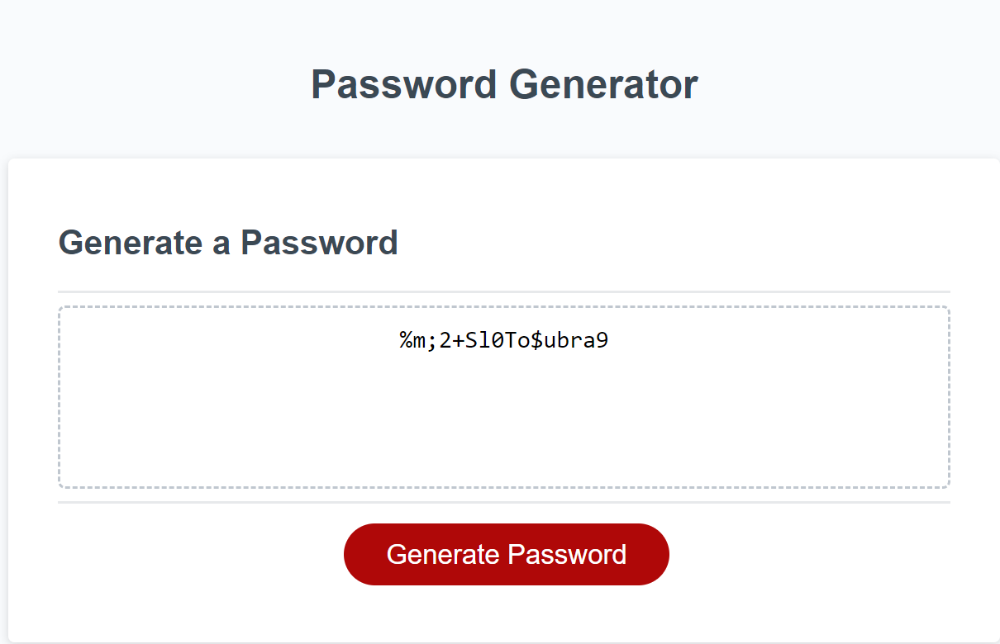

# Challenge-03 - JavaScript Password Generator Project

## Description
The purpose of this project is to create a password generator applicaiton to address the following user story and acceptance criteria. Acceptance Criteria have been broken down into indidivual features (e.g. AC01). For details on each implementation, review the applicable 'AC' number in the "Features" section of this README.

### User Story

* AS AN employee with access to sensitive data,
I WANT to randomly generate a password that meets certain criteria,
SO THAT I can create a strong password that provides greater security

### Acceptance Criteria

> * GIVEN I need a new, secure password
> * AC01: Execute password generation
>    -	WHEN I click the button to generate a password
>    -	THEN I am presented with a series of prompts for password criteria    

>* AC02: Criteria Selection
>    -	WHEN prompted for password criteria
>    -	THEN I select which criteria to include in the password

>* AC03: Password Length Selection
>    -	WHEN prompted for the length of the password
>    -	THEN I choose a length of at least 8 characters and no more than 128 characters

>* AC04: Character Type Selection
>    -	WHEN asked for character types to include in the password
>    -	THEN I confirm whether or not to include any or all of the following:
>       - lowercase
>       - uppercase
>       - numeric
>       - special characters

>* AC05: Character Type Selection Prompts
>    -	WHEN I answer each prompt
>    -	THEN my input should be validated and at least one character type should be selected

>* AC06: Password Generation
>    -	WHEN all prompts are answered
>    -	THEN a password is generated that matches the selected criteria

>* AC07: Password Display
>    -	WHEN the password is generated
>    -	THEN the password is either displayed in an alert or written to the page

## Installation

> * To launch the webpage, open the browser and paste the following URL in the address bar: https://recenasu.github.io/03-js-password-generator-project/
> * To access the project repo, open the browser and paste the following URL in the address bar: https://github.com/recenasu/03-js-password-generator-project

## Usage

From the webpage click on the Generate Password button. Follow the prompts to make the desired selections. After all prompts have been successfully answered, the generated password is displayed. To run the program again, refresh the webpage.

The following images show the application sequence.

## Credits

N/A

## License

N/A

## Features

> * This application generates a password to the strength of the user's preference.
> * The user selects:
>   - The password length
>   - The types of characters to be included:
>       - lowercase
>       - uppercase
>       - numbers
>       - special characters
> * A password is randomly generated using the selected critera and displayed for the user. 
    

## Tests

>1. Open the "03-js-password-generator-project" repo using VSCode
>2. Open the "index.html" file in Google Chrome
>3. Right-click on the webpage and select Inspect
>4. Select the Console to view the console logs to confirm the correct character sets are being selected when the user makes selections
>5. On the webpage, click Generate Password
>6. At the password length prompt, enter a value outside the displayed range.
>7. Confirm an error alert appears.
>8. Click OK in the alert and verify the application does not proceed further.
>9. Click Generate Password again.
>10. Answer the prompts to set the criteria
>11. Confirm that a password appears after the last prompt is answered.
>12. Confirm the password meets the user-defined criteria.
>13. Refresh the webpage to reset the application.
>14. Repeat steps 5-13 trying different combinations of character type selections.
